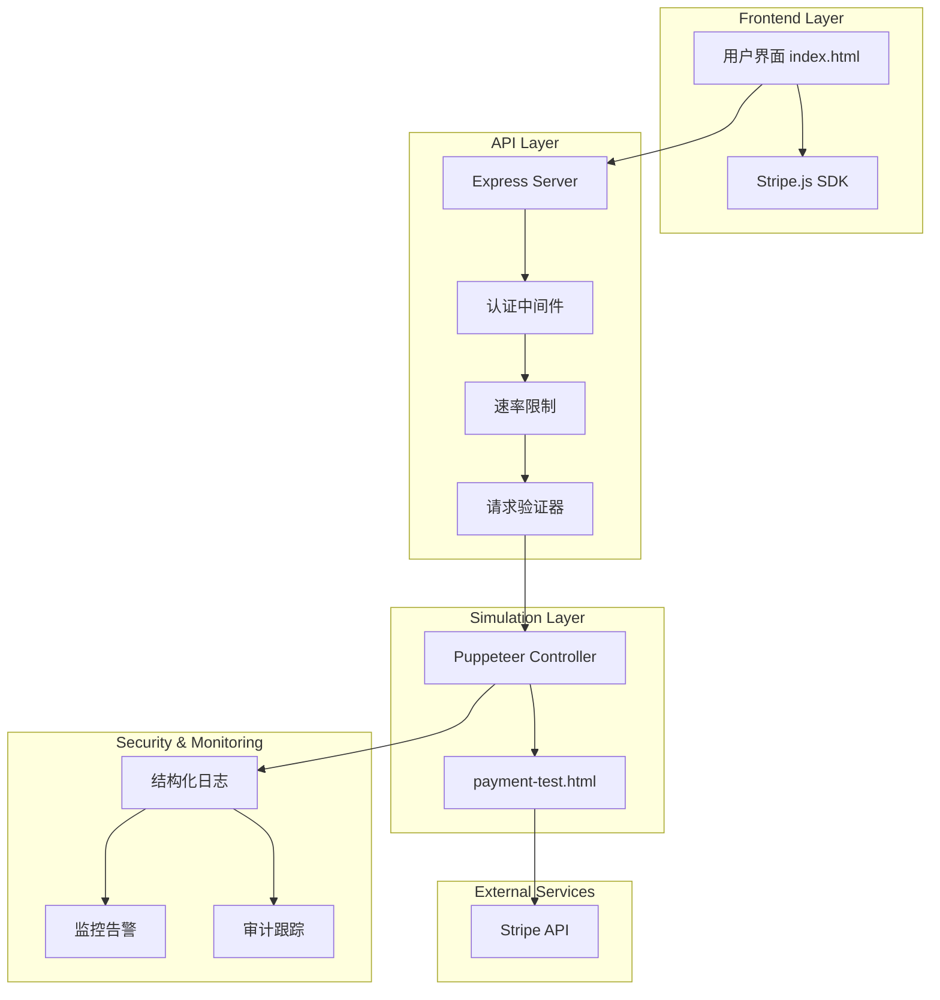
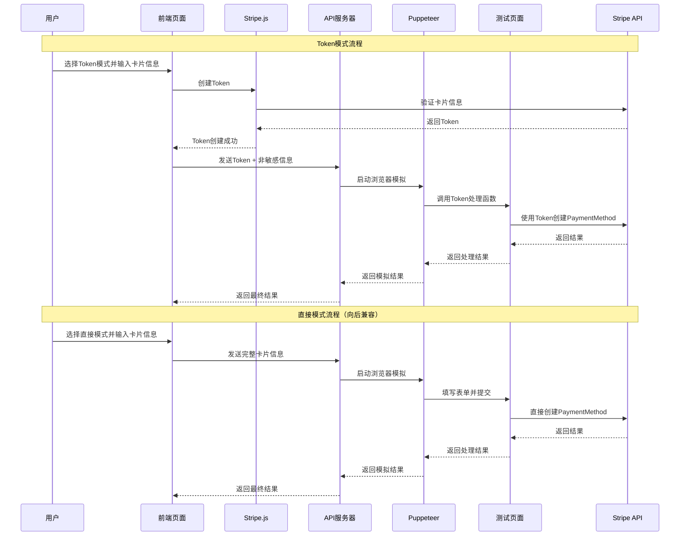

# Design Document

## Overview

本设计文档描述了支付模拟API的安全增强方案，重点实现Stripe Token机制、双模式支持和生产环境合规性。设计基于现有的Puppeteer + Express架构，通过增量改进的方式实现安全性提升，同时保持向后兼容性。

## Architecture

### 系统架构图



### 双模式处理流程



## Components and Interfaces

### 1. 前端组件增强

#### 1.1 模式选择器组件
```javascript
class ModeSelector {
    constructor() {
        this.currentMode = 'direct'; // 默认直接模式
        this.stripe = Stripe(STRIPE_PUBLISHABLE_KEY);
    }
    
    async createToken(cardInfo) {
        // Token模式：在前端创建安全token
        const { token, error } = await this.stripe.createToken('card', {
            number: cardInfo.number,
            exp_month: cardInfo.expMonth,
            exp_year: cardInfo.expYear,
            cvc: cardInfo.cvv,
            name: cardInfo.name,
            address_zip: cardInfo.postalCode
        });
        
        if (error) {
            throw new Error(`Token creation failed: ${error.message}`);
        }
        
        return token;
    }
}
```

#### 1.2 安全请求构建器
```javascript
class SecureRequestBuilder {
    static buildTokenRequest(token, cardholderName, browserEnv) {
        return {
            stripeToken: token.id,
            cardholderName: cardholderName,
            browserEnv: browserEnv,
            tokenMetadata: {
                last4: token.card.last4,
                brand: token.card.brand,
                exp_month: token.card.exp_month,
                exp_year: token.card.exp_year
            }
        };
    }
    
    static buildDirectRequest(cardInfo, browserEnv) {
        return {
            cardInfo: cardInfo,
            browserEnv: browserEnv
        };
    }
}
```

### 2. 后端API增强

#### 2.1 认证中间件
```javascript
class AuthenticationMiddleware {
    static validateApiKey(req, res, next) {
        const apiKey = req.headers['x-api-key'] || req.query.apiKey;
        
        if (!apiKey || !this.isValidApiKey(apiKey)) {
            return res.status(401).json({
                error: 'Unauthorized',
                message: 'Valid API key required'
            });
        }
        
        req.apiKeyInfo = this.getApiKeyInfo(apiKey);
        next();
    }
    
    static isValidApiKey(key) {
        // 实现API密钥验证逻辑
        return process.env.VALID_API_KEYS?.split(',').includes(key);
    }
}
```

#### 2.2 请求验证器
```javascript
class RequestValidator {
    static validatePaymentRequest(req, res, next) {
        const { stripeToken, cardInfo, browserEnv } = req.body;
        
        // 确定模式
        const isTokenMode = stripeToken && !cardInfo;
        const isDirectMode = cardInfo && !stripeToken;
        
        if (!isTokenMode && !isDirectMode) {
            return res.status(400).json({
                error: 'Invalid request format',
                message: 'Use either Token mode (stripeToken + cardholderName) or Direct mode (cardInfo)'
            });
        }
        
        // 验证必要字段
        if (!browserEnv) {
            return res.status(400).json({
                error: 'Missing required field',
                message: 'browserEnv is required'
            });
        }
        
        req.simulationMode = isTokenMode ? 'token' : 'direct';
        next();
    }
}
```

#### 2.3 安全日志记录器
```javascript
class SecureLogger {
    static logPaymentRequest(req, result) {
        const logData = {
            timestamp: new Date().toISOString(),
            mode: req.simulationMode,
            sourceIP: req.ip,
            userAgent: req.get('User-Agent'),
            apiKey: req.apiKeyInfo?.id,
            success: !result.error,
            ...(req.simulationMode === 'token' ? {
                tokenLast4: req.body.tokenMetadata?.last4,
                tokenBrand: req.body.tokenMetadata?.brand
            } : {
                cardLast4: req.body.cardInfo?.number?.slice(-4)
            })
        };
        
        // 结构化日志输出
        console.log(JSON.stringify(logData));
    }
}
```

### 3. Puppeteer控制器增强

#### 3.1 安全浏览器启动器
```javascript
class SecureBrowserLauncher {
    static async launch(browserEnv) {
        const browser = await puppeteer.launch({
            headless: true,
            args: [
                '--no-sandbox',
                '--disable-setuid-sandbox',
                '--disable-dev-shm-usage',
                '--disable-web-security',
                '--disable-features=VizDisplayCompositor'
            ]
        });
        
        const page = await browser.newPage();
        
        // 设置浏览器环境
        if (browserEnv.userAgent) {
            await page.setUserAgent(browserEnv.userAgent);
        }
        
        if (browserEnv.viewport) {
            await page.setViewport(browserEnv.viewport);
        }
        
        return { browser, page };
    }
}
```

#### 3.2 模式特定处理器
```javascript
class PaymentModeHandler {
    static async handleTokenMode(page, stripeToken, cardholderName) {
        await page.goto(`http://localhost:${port}/payment-test.html`);
        await page.waitForSelector('#payment-form');
        
        if (cardholderName) {
            await page.type('#card-name', cardholderName);
        }
        
        // 调用Token处理函数
        const result = await page.evaluate(async (token) => {
            return await window.triggerStripePaymentWithToken(token);
        }, stripeToken);
        
        return result;
    }
    
    static async handleDirectMode(page, cardInfo) {
        await page.goto(`http://localhost:${port}/payment-test.html`);
        await page.waitForSelector('#payment-form');
        
        // 填写表单信息
        if (cardInfo.name) {
            await page.type('#card-name', cardInfo.name);
        }
        
        // 处理Stripe Elements iframe
        const frames = page.frames();
        const stripeFrame = frames.find(frame =>
            frame.url().includes('elements-inner-card')
        );
        
        if (!stripeFrame) {
            throw new Error('Stripe card input iframe not found');
        }
        
        // 填写卡片信息
        await stripeFrame.type('input[name="cardnumber"]', cardInfo.number);
        await stripeFrame.type('input[name="exp-date"]', `${cardInfo.expMonth}${cardInfo.expYear.slice(-2)}`);
        await stripeFrame.type('input[name="cvc"]', cardInfo.cvv);
        
        if (cardInfo.postalCode) {
            await stripeFrame.type('input[name="postal"]', cardInfo.postalCode);
        }
        
        // 触发支付
        const result = await page.evaluate(async () => {
            return await window.triggerStripePayment();
        });
        
        return result;
    }
}
```

## Data Models

### 1. 请求数据模型

```typescript
interface TokenModeRequest {
    stripeToken: string;
    cardholderName?: string;
    browserEnv: BrowserEnvironment;
    tokenMetadata?: {
        last4: string;
        brand: string;
        exp_month: number;
        exp_year: number;
    };
}

interface DirectModeRequest {
    cardInfo: {
        name: string;
        number: string;
        expMonth: string;
        expYear: string;
        cvv: string;
        postalCode?: string;
    };
    browserEnv: BrowserEnvironment;
}

interface BrowserEnvironment {
    userAgent: string;
    viewport: {
        width: number;
        height: number;
    };
    locale?: string;
    timezone?: string;
}
```

### 2. 响应数据模型

```typescript
interface PaymentSimulationResult {
    success?: {
        paymentMethodId: string;
        mode: 'token' | 'direct';
        metadata?: {
            last4?: string;
            brand?: string;
        };
    };
    error?: string;
    timestamp: string;
    requestId: string;
}
```

### 3. 审计日志模型

```typescript
interface AuditLog {
    timestamp: string;
    requestId: string;
    mode: 'token' | 'direct';
    sourceIP: string;
    userAgent: string;
    apiKeyId?: string;
    success: boolean;
    cardLast4?: string;
    tokenId?: string;
    errorMessage?: string;
    processingTime: number;
}
```

## Error Handling

### 1. 分层错误处理策略

```javascript
class ErrorHandler {
    static handleStripeError(error) {
        const errorMap = {
            'card_declined': 'Card was declined',
            'expired_card': 'Card has expired',
            'incorrect_cvc': 'CVC is incorrect',
            'processing_error': 'Processing error occurred'
        };
        
        return {
            type: 'stripe_error',
            message: errorMap[error.code] || error.message,
            code: error.code
        };
    }
    
    static handlePuppeteerError(error) {
        if (error.message.includes('timeout')) {
            return {
                type: 'timeout_error',
                message: 'Browser operation timed out',
                retryable: true
            };
        }
        
        return {
            type: 'browser_error',
            message: 'Browser automation failed',
            details: error.message
        };
    }
    
    static handleValidationError(field, message) {
        return {
            type: 'validation_error',
            field: field,
            message: message
        };
    }
}
```

### 2. 优雅降级机制

```javascript
class FallbackHandler {
    static async handleTokenModeFailure(cardInfo, browserEnv) {
        console.warn('Token mode failed, falling back to direct mode');
        
        return await PaymentModeHandler.handleDirectMode(page, cardInfo);
    }
    
    static async handleBrowserFailure(retryCount = 0) {
        if (retryCount < 3) {
            console.warn(`Browser failure, retrying... (${retryCount + 1}/3)`);
            await new Promise(resolve => setTimeout(resolve, 1000 * (retryCount + 1)));
            return true; // 允许重试
        }
        
        throw new Error('Browser automation failed after 3 attempts');
    }
}
```

## Testing Strategy

### 1. 单元测试

```javascript
describe('PaymentModeHandler', () => {
    describe('Token Mode', () => {
        it('should handle valid token successfully', async () => {
            const mockToken = 'tok_1234567890';
            const result = await PaymentModeHandler.handleTokenMode(mockPage, mockToken, 'John Doe');
            expect(result.success).toBeDefined();
        });
        
        it('should handle invalid token gracefully', async () => {
            const invalidToken = 'invalid_token';
            const result = await PaymentModeHandler.handleTokenMode(mockPage, invalidToken, 'John Doe');
            expect(result.error).toBeDefined();
        });
    });
    
    describe('Direct Mode', () => {
        it('should fill card information correctly', async () => {
            const cardInfo = {
                name: 'John Doe',
                number: '4242424242424242',
                expMonth: '12',
                expYear: '2028',
                cvv: '123'
            };
            
            const result = await PaymentModeHandler.handleDirectMode(mockPage, cardInfo);
            expect(result.success).toBeDefined();
        });
    });
});
```

### 2. 集成测试

```javascript
describe('API Integration', () => {
    it('should process token mode request end-to-end', async () => {
        const tokenRequest = {
            stripeToken: 'tok_test_1234',
            cardholderName: 'John Doe',
            browserEnv: {
                userAgent: 'Mozilla/5.0...',
                viewport: { width: 1920, height: 1080 }
            }
        };
        
        const response = await request(app)
            .post('/api/simulate-payment')
            .set('x-api-key', 'test-api-key')
            .send(tokenRequest);
            
        expect(response.status).toBe(200);
        expect(response.body.success).toBeDefined();
    });
});
```

### 3. 安全测试

```javascript
describe('Security Tests', () => {
    it('should reject requests without API key', async () => {
        const response = await request(app)
            .post('/api/simulate-payment')
            .send({});
            
        expect(response.status).toBe(401);
    });
    
    it('should not log sensitive card information', async () => {
        const logSpy = jest.spyOn(console, 'log');
        
        await simulatePayment(directModeRequest);
        
        const logCalls = logSpy.mock.calls.flat();
        const hasFullCardNumber = logCalls.some(call => 
            typeof call === 'string' && call.includes('4242424242424242')
        );
        
        expect(hasFullCardNumber).toBe(false);
    });
});
```

## Security Considerations

### 1. 数据保护措施

- **Token优先**: 推荐使用Token模式，避免敏感数据传输
- **日志安全**: 只记录卡号后四位和token ID
- **内存清理**: 及时清理内存中的敏感数据
- **传输加密**: 生产环境强制HTTPS

### 2. 访问控制

- **API密钥认证**: 所有请求需要有效API密钥
- **速率限制**: 防止暴力攻击和滥用
- **IP白名单**: 限制访问来源
- **请求审计**: 记录所有访问日志

### 3. 合规性要求

- **PCI DSS**: 遵循支付卡行业数据安全标准
- **数据最小化**: 只处理必要的数据
- **审计跟踪**: 完整的操作记录
- **事件响应**: 安全事件处理流程